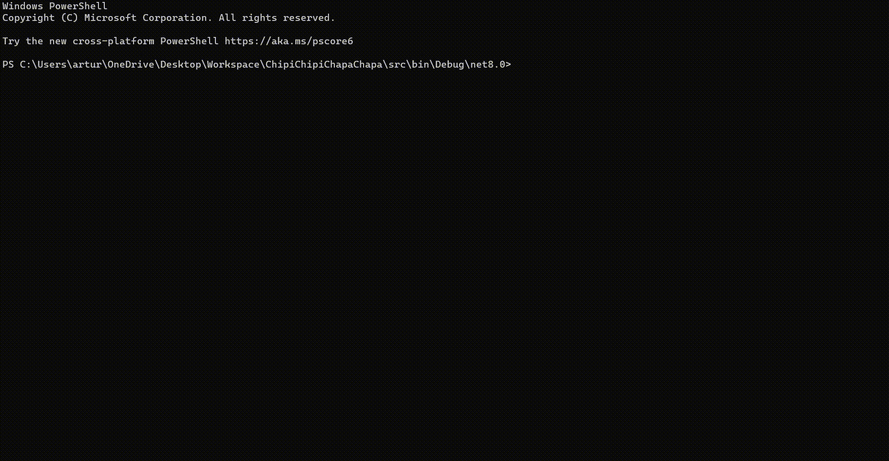

# ChipiChipiChapaChapa

Chipi chipi chapa chapa in your CMD now as well :D

## Table of contents
* [General info](#general-info)
* [Code](#code)
* [Technologies](#technologies)
* [Screenshots](#screenshots)
* [Setup](#setup)
* [Status](#status)
* [Inspiration](#inspiration)

## General info

Chipi chipi, chapa chapa 
Dubidubi, dabadaba
Mágico mi dubidubi boom, boom, boom, boom
Chipi chipi, chapa chapa
Dubidubi, daba daba
Mágico mi dubidubi boom

## Code
In order to loop the sound I used [Mark Heath's](https://github.com/markheath) [LoopStream class](https://www.markheath.net/post/looped-playback-in-net-with-naudio) and its pretty cool :D  

## Screenshots

Pic.1 ChipiChipiChapaChapa in CMD 

## Technologies
* .NET 8

## Setup

Just `dotnet run`. One could also build as standalone executable `dotnet publish -r win-x64 -c Release /p:PublishSingleFile=true`

## Status
Project is: _finished_

## Inspiration
For the memes!